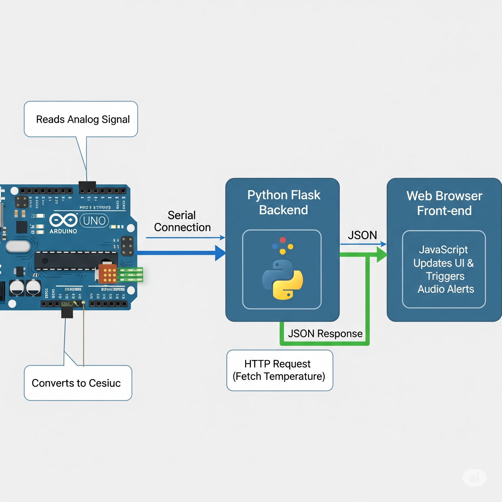
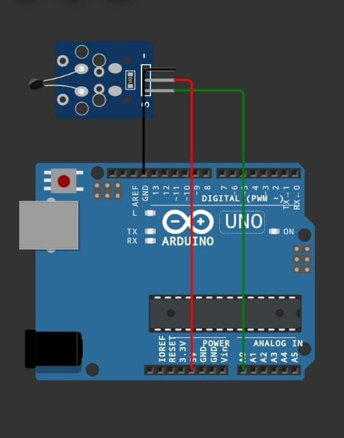
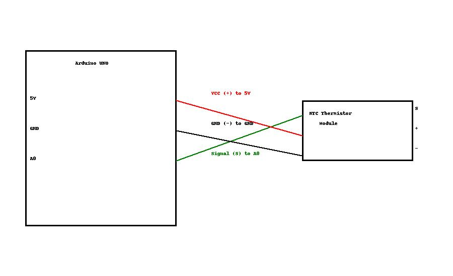
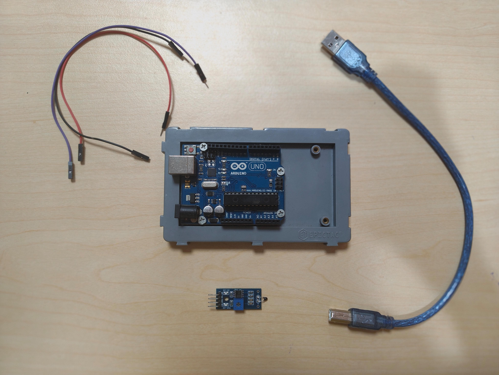
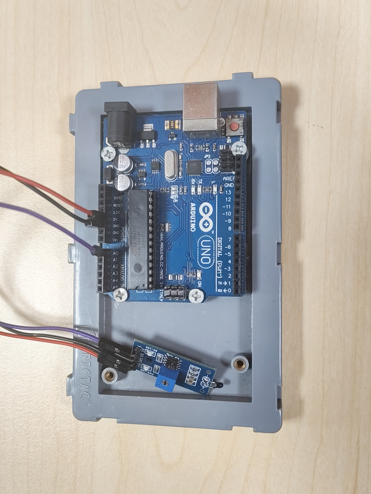
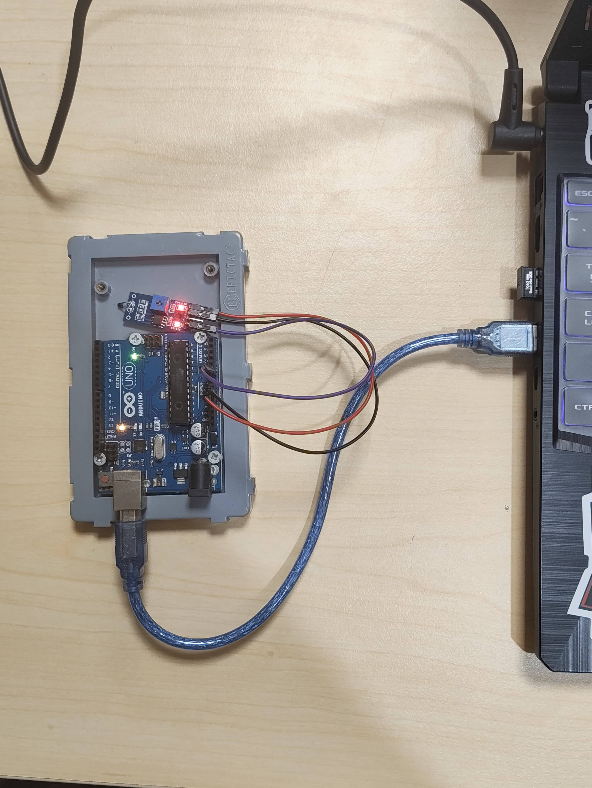

# ഒരു ചായ അപാരത🎯

## Basic Details
### Team Name: [NeuroNet]

### Team Members
- Team Lead: Justin Roy - College Of Engineering, Perumon
- Member 2: Hanna A - College Of Engineering, Perumon

### Project Description
This IoT system measures a beverage's temperature using an Arduino-interfaced thermistor. A Python Flask server processes and provides this data via a JSON API. A web front-end consumes this API to deliver real-time visual and auditory feedback on the beverage's thermal state.

### The Problem (that doesn't exist)
Too often, the love for tea is marred by a common dilemma: either scalding your throat on a cup that's too hot or waiting too long only to be met with a cold, disappointing drink. That is precisely where our project steps in. It eliminates this guesswork, guiding you to that ideal window of time to enjoy the perfect sip, every time.

### The Solution (that nobody asked for)
Our system constantly checks your tea's temperature to tell you the precise moment it's perfect to drink. It eliminates the guesswork, so you no longer have to worry about burning your mouth or drinking it cold.

## Technical Details
### Technologies/Components Used
For Software:
- Programming languages :Python,JavaScript,HTML,CSS,Arduino Programming language
- Libraries:Flask,time,serial,threading,os
- Tools:Vs Code,Arduino IDE,vimeo,cloudinary,postimages,chatgpt,gemini2.5 pro, cursor AI

For Hardware:
- Arduino UNO,NTC-Thermistor Module,
-10k ohm NTC 3362 , F-M jumper cables,USB-A to USB-B cable

### Implementation
For Software:
*Arduino IDE: The embedded software was developed using the Arduino IDE in C++. The program's primary functions are to read the analog voltage from the NTC thermistor module, convert this raw data into a precise temperature reading in Celsius, and continuously transmit this value to a computer via the serial (USB) port.*

*Python Backend (Flask): A lightweight backend was created using the Flask web framework in Python. This server application has two main responsibilities:

It uses the pySerial library to listen to the serial port and capture the incoming temperature data from the Arduino.

It establishes a simple API endpoint that, when accessed, serves the latest temperature reading in a structured JSON format, making it easily accessible for any web client.*

*Frontend Web Interface (HTML/CSS/JS): The user interface is a modern, single-page web application built with standard web technologies:

HTML was used to define the structure of the dashboard, including the gauge, information sections, and audio elements.

CSS provides the "Neon Munnar" futuristic styling, responsive layout, and visual feedback elements like color changes and animations.*

*JavaScript handles all the dynamic functionality. It sends periodic fetch requests to the Python backend to get the live temperature, updates the UI in real-time, and triggers the appropriate audio alerts based on the predefined temperature ranges (cold, perfect, or hot).*
# Installation
pip install flask pyserial

npm install

# Run
python app.py

### Project Documentation
For Software:

# Screenshots (Add at least 3)
.png)
*Shows the final reading of the NTC thermistor module retrieved from the backend*

.png)
*An informative carousel tells the perfect time to drink chai*

.png)
*A small video dedicated to empowering chai and emphasizing its ambit*

# Diagrams

*The arduino uno reads the code from IDE then the analog values is passed to Arduino IDE which is converted to temperature (+_5 accuracy) this is passed to python flask which in turn is fetched by javascript in front end, javascript regularly checks python for temperature reading and thus give a live reading experience *

For Hardware:

# Schematic & Circuit

*The VCC part of the NTC Thermistor Module is connected to 5v of Arduino,
The GND is connected to GND of the Arduino UNO,
The A0 (out) is connected to A0 of Arduino through which Analog values is read*

*VCC Connects to the 5v side of Arduino*
*GND connects to GND of Arduino UNO*
*A0 of NTC connected to A0 of Arduino UNO.*

# Build Photos

*Jumper wires,Arduino UNO,Connecting cable, NTC Thermistor Module*

*VCC Connects to the 5v side of Arduino*
*GND connects to GND of Arduino UNO*
*A0 of NTC connected to A0 of Arduino UNO.*
*The power and data cable is connected to laptop and Arduino board*

The "Oru Chaya Apaaratha" project operates as a full-stack IoT system, beginning with an Arduino Uno and an NTC thermistor module that capture real-world temperature data. Code uploaded via the Arduino IDE converts this analog signal into a Celsius value, which is then sent continuously over a serial connection to a Python Flask backend. This backend application acts as a middleman, listening for the serial data and exposing it through a simple JSON API endpoint. The user interacts with a dynamic front-end, built with HTML, CSS, and JavaScript, which is deployed and hosted globally on Vercel. This web interface periodically fetches the temperature from the Flask API, updating the on-screen gauge and triggering corresponding audio alerts to create a responsive and engaging user experience.

### Project Demo
# Video
[Software deployment](https://drive.google.com/file/d/1TNzKh5TgT4OSgnkRx1XR9-0rlcyuwDVO/view?usp=sharing)

[live walkthrough](https://drive.google.com/file/d/13KrJmtzMdqwpTcchW2wANFsj3l_iKLo_/view?usp=sharing)
It is a walkthrough of the front end part of the web we created.

# Additional Demos
[Hosted Live at vercel](https://chaya-sable.vercel.app/)

## Team Contributions
- Justin Roy: Backend using python, circuit design
- Hanna A: Front-end development,Storyboard video.

---
Made with ❤️ at TinkerHub Useless Projects 

